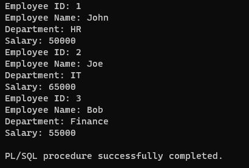

# <p align="center"> Ex. No: 6 Creating Cursors using PL/SQL</p>
### DATE: 26/09/23
## AIM: 
To create a cursor using PL/SQL.

## Steps:
1. Create employee table with following attributes (empid NUMBER, empname VARCHAR(10), dept VARCHAR(10),salary NUMBER);
2. Create a cursor named as employee_cursor
3. Using cursor read each record and display the result
4. Close the cursor

## Program:
### Create employee table
```
 create table empe(empid NUMBER,empname VARCHAR2(10),dept VARCHAR2(10), salary NUMBER);
```
### PLSQL Cursor code
```
SET SERVEROUTPUT ON
DECLARE
CURSOR empe_cursor IS
SELECT empid,empname,dept,salary
FROM empe;
emp_id NUMBER;
emp_name VARCHAR(50);
emp_dept VARCHAR(50);
emp_salary NUMBER;
```
```
BEGIN
OPEN empe_cursor;
LOOP
FETCH empe_cursor INTO emp_id, emp_name, emp_dept, emp_salary;
EXIT WHEN empe_cursor%NOTFOUND;
DBMS_OUTPUT.PUT_LINE('Employee ID: ' || emp_id);
DBMS_OUTPUT.PUT_LINE('Employee Name: ' || emp_name);
DBMS_OUTPUT.PUT_LINE('Department: ' || emp_dept);
DBMS_OUTPUT.PUT_LINE('Salary: ' || emp_salary);
END LOOP;
CLOSE empe_cursor;
END;
/
```
## Output:

## Result:
Thus, a cursor using PL/SQL is executed successfully.
